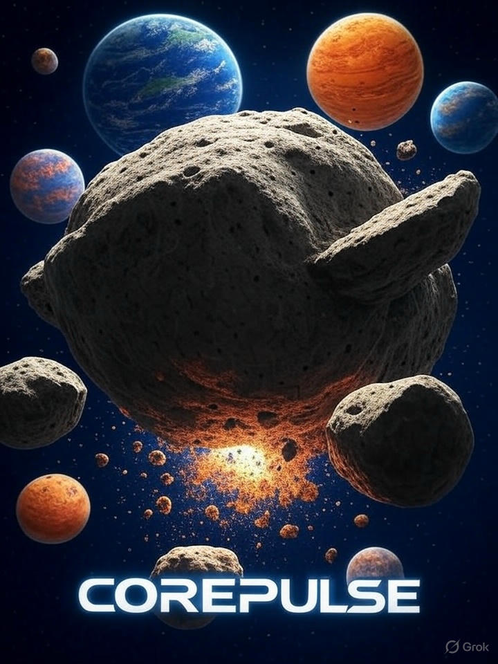

# CorePulse



**CorePulse** is an open-source mech combat game inspired by classic 1990s titles, built with modern C++20/C++23 and OpenGL 4.3+. Experience authentic giant robot combat with deep customization, immersive 3D audio, and tactical gameplay.

## 🚀 Current Features

### 🎮 Engine Core
- **Modern ECS Architecture** - Entity Component System with C++20 concepts
- **Cross-Platform** - Linux and Windows support via SDL2
- **Advanced Rendering** - OpenGL 4.3+ with PBR (Physically Based Rendering)
- **3D Spatial Audio** - Distance-based audio with collision sounds
- **Physics System** - Rigid body dynamics with realistic collision detection

### 🤖 Mech System
- **glTF 2.0 Asset Pipeline** - Industry-standard model loading
- **Custom Extensions** - `CP_walker_hardpoints` and `CP_damage_zones`
- **Mech Variants** - Light, Medium, and Heavy class mechs
- **Weapon Systems** - Energy and ballistic hardpoints
- **Damage Modeling** - Component-based armor and internal structure

### 🗺️ Mission System
- **Mission Framework** - Complete objective tracking system
- **glTF-Based Missions** - Missions stored as enhanced glTF files
- **Multiple Objective Types** - Elimination, Escort, Defend, Navigate, Collect, Timer
- **Lua Scripting Support** - Custom mission logic (when Lua is available)
- **Mission Validation** - Built-in validation for mission files

### 🌍 World & Environment
- **Procedural Terrain** - Multiple landscape types (Battlefield, Hills, Mountains, Desert)
- **Dynamic Weather** - Real-time terrain generation and switching
- **Asset Management** - Efficient loading and organization of game assets

## 🎮 Controls

### Camera Controls
- **T** - Toggle camera mode (Free/Orbital)

#### Free Camera Mode (Default)
- **WASD** - 3D movement (W/S: forward/back, A/D: strafe left/right)
- **Q/E** - Move up/down in world space
- **Mouse drag** - Look around (FPS-style)

#### Orbital Camera Mode
- **WASD** - Orbit controls (W/S: zoom, A/D: rotate)
- **Q/E** - Move camera up/down
- **P** - Toggle auto rotation

#### Universal Controls
- **Mouse wheel** - Zoom in/out
- **Arrow keys** - Step camera rotation

### Game Controls
- **ESC** - Quit application
- **F11** - Toggle fullscreen
- **I** - Toggle info display
- **R/J** - Toggle wireframe mode
- **SPACE** - Drop physics sphere (reset demo)

### Terrain Controls
- **L** - Cycle terrain types
- **;** - Regenerate current terrain

### Debug Controls
- **H** - Move mechs to origin
- **K** - Move primary mech in front of camera

## 🛠️ Building from Source

### Prerequisites
- **C++20 Compatible Compiler** (GCC 10+, Clang 11+, MSVC 2019+)
- **CMake 3.20+**
- **SDL2** development libraries
- **OpenGL 4.3+** support
- **GLEW** (OpenGL Extension Wrangler)
- **nlohmann/json** for JSON parsing
- **Lua 5.3+** (optional, for mission scripting)

### Linux Build Instructions
```bash
# Install dependencies (Ubuntu/Debian)
sudo apt update
sudo apt install build-essential cmake libsdl2-dev libglew-dev liblua5.3-dev

# Clone and build
git clone <repository-url>
cd CorePulse
mkdir build && cd build

# Configure with vcpkg (if available)
cmake .. -DCMAKE_TOOLCHAIN_FILE=/path/to/vcpkg/scripts/buildsystems/vcpkg.cmake

# Or configure without vcpkg
cmake ..

# Build
make -j$(nproc)

# Run
./bin/corepulse
```

### Windows Build Instructions
```cmd
# Install dependencies via vcpkg
vcpkg install sdl2 glew nlohmann-json lua

# Configure and build
mkdir build && cd build
cmake .. -DCMAKE_TOOLCHAIN_FILE=[vcpkg root]/scripts/buildsystems/vcpkg.cmake
cmake --build . --config Release

# Run
bin/corepulse.exe
```

## 🎯 Mission System Usage

### Creating Missions
CorePulse uses enhanced glTF 2.0 files for missions. Create a `.gltf` file with the `CP_mission_data` extension:

```json
{
  "asset": { "version": "2.0" },
  "extensions": {
    "CP_mission_data": {
      "name": "Training Mission",
      "description": "Eliminate all enemy targets",
      "objectives": [
        {
          "id": "eliminate_targets",
          "type": "elimination",
          "description": "Destroy all enemy mechs",
          "target_nodes": [1, 2]
        }
      ],
      "spawn_points": [
        {
          "name": "player_start",
          "position": [0, 0, 0],
          "is_player_spawn": true
        }
      ]
    }
  }
}
```

### Mission File Location
Place mission files in `assets/missions/` directory with `.gltf` extension.

### Available Objective Types
- **Elimination** - Destroy specific targets
- **Escort** - Protect and guide allies
- **Defend** - Protect a location or object
- **Navigate** - Reach a specific location
- **Collect** - Gather items or data
- **Timer** - Survive for a duration
- **Custom** - Lua-scripted objectives

## 📁 Project Structure

```
CorePulse/
├── assets/                 # Game assets
│   ├── audio/             # Sound effects and music
│   ├── missions/          # Mission files (.gltf)
│   ├── models/            # 3D models
│   │   ├── walkers/       # Mech models
│   │   ├── weapons/       # Weapon models
│   │   └── environment/   # Environmental objects
│   └── textures/          # Texture files
├── include/               # Header files
├── src/                   # Source code
├── tests/                 # Unit tests
├── docs/                  # Documentation
└── build/                 # Build output
```

## 🔧 Development Status

### ✅ Completed (Phase 1 - Foundation)
- [x] Build system and environment setup
- [x] Window management and input handling
- [x] OpenGL renderer with PBR shaders
- [x] Entity Component System (ECS)
- [x] 3D spatial audio system
- [x] Physics simulation with collision detection
- [x] glTF 2.0 asset loading with custom extensions
- [x] Terrain generation system
- [x] Mission system framework with Lua scripting

### 🚧 In Progress (Phase 2 - Core Systems)
- [ ] Enhanced physics and collision detection
- [ ] Mech simulation (heat management, damage modeling)
- [ ] Weapon systems and combat mechanics
- [ ] AI system for enemy mechs
- [ ] Advanced UI framework

### 📋 Planned (Phase 3 - Game Logic)
- [ ] Complete mission system integration
- [ ] MechLab customization interface
- [ ] Campaign system
- [ ] Multiplayer foundation
- [ ] Audio improvements and music system

## 🤝 Contributing

We welcome contributions! Please see our [contributing guidelines](CONTRIBUTING.md) for details on:
- Code style and standards
- Submitting bug reports
- Creating pull requests
- Development workflow

## 📄 License

This project is licensed under the MIT License - see the [LICENSE](LICENSE) file for details.

## 🎮 Demo Features

The current build includes several interactive demos:

### Physics Demo
- Red bouncing sphere with realistic physics
- 3D collision sounds based on impact velocity
- Interactive terrain with collision detection

### Mech Formation Demo
- Three mech classes (Light, Medium, Heavy) with different hardpoint configurations
- Authentic mech scaling and visual design
- Component-based damage zone visualization

### Audio Demo
- Ambient environmental sounds
- 3D positional audio with distance attenuation
- Dynamic collision sound effects

### Terrain Demo
- Multiple procedural landscape types
- Real-time terrain switching and generation
- Integrated physics collision

---

**CorePulse** - Experience the authentic thrill of giant robot combat! 🤖⚡